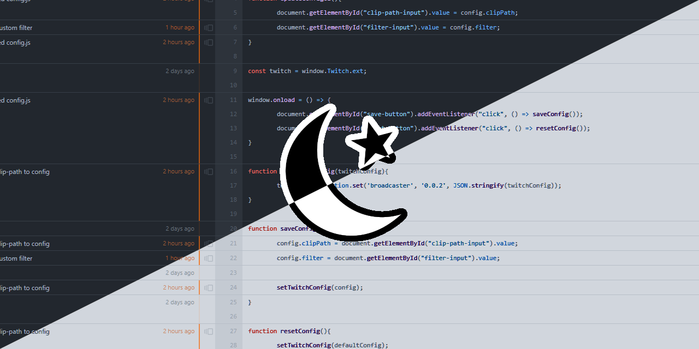

# twitch-extension-color-inverter

&emsp;Twitch extension to invert the stream colors, useful for toggling dark/light mode.

The extension adds a overlay filter with the css property backdrop-filter, which can be used to switch between dark/light mode.

Features:
- mask out streamer camera or other areas
- set custom filter by defining backdrop-filter property

Walkthrough:
- in config: set filter and clip-path, you can reset your changes
- in stream: toggle overlay by clicking on the button on the top right

